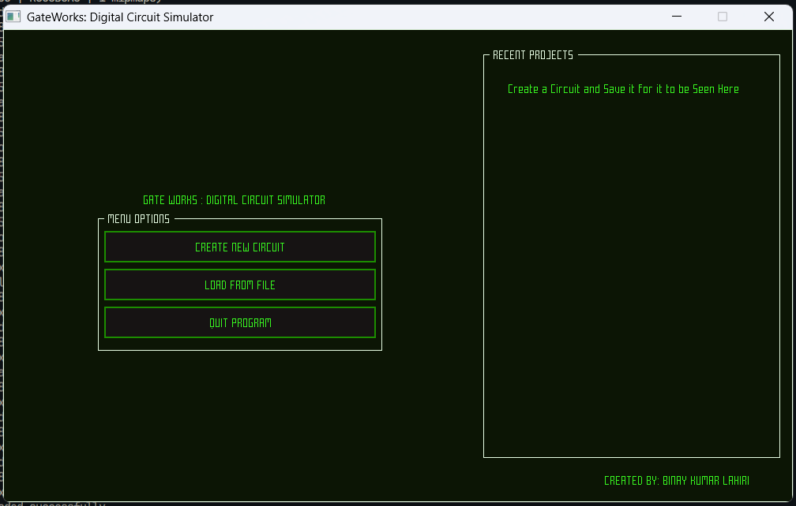
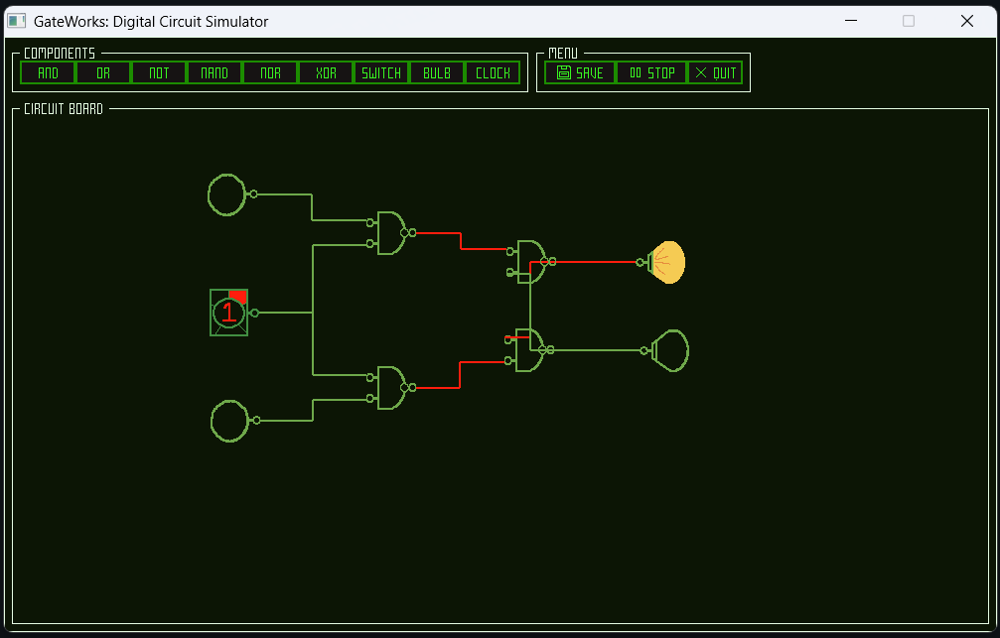

# GateWorks---Digital-Circuit-Simulator
GateWorks is a simple digital circuit simulator built in C++ using the Raylib Game dev library for C/C++ and the Raygui immediate mode GUI for all the GUI part and tinyfiledialog for all the file Dialog requirements

## Features

- **Simple UI:** Simple and Easy to use Interface which is both intuitive and blazingly fast
- **Real-time simulation:** See circuit outputs update instantly as you interact with inputs.
- **Save/load projects:** Store your designs and reload them later in simple text (.txt) files for easy sharing.
- **Recent Projects:** Easily access all your recent projects just from the menu screen by only one click
- **Big Collection of Components:** Provides almost all the basic components required for creating and simulating a digital circuit for learning and testing purposes like all the Gates, Switch, Bulb, and a Clock with 5 levels of timer settings(i.e 1Hz, 5Hz, 15Hz, 30Hz, and 60Hz)
- **User Friendly:** Very simple and intuitive gestures which makes the program very user friendly. 

## Future Planned Features
- **Large Working Area:** Currently the working area is contrained within the window only but a large working area for more complex and big circuits is planed
- **Panning & Zooming:** Panning and Zooming feature for easy pin selection and navigation
- **Online Library of Circuits:** Not sure but maybe one day I will try to add an online library of cicuits to easily download/upload your work to share with others but not now as I am still learning to work with C++ in these kind of things
## Technologies Used

- **C++:** Core application logic and simulation.
- [**Raylib:**](https://www.raylib.com/) Rendering engine for graphics and input handling.
- [**Raygui:**](https://github.com/raysan5/raygui) Immediate mode GUI for toolbars, dialogs, and controls.
- [**TinyFileDialog:**](https://sourceforge.net/p/tinyfiledialogs/code/ci/master/tree/) A simple, lightweight platform independent file dialog for the projects to handle save and load
- [**Cmake & Make:**](https://cmake.org/) Powerfull build systems for the C/C++ projects

## Screenshots

### Menu Screen


### Home Screen


## Installation

1. **Clone the repository:**
  ```bash
  git clone https://github.com/yourusername/GateWorks---Digital-Circuit-Simulator.git
  cd GateWorks---Digital-Circuit-Simulator
  ```
2. **Install dependencies:**
  - [Raylib](https://www.raylib.com/)
  - [Raygui](https://github.com/raysan5/raygui)
  - C++17 compatible compiler (GCC, Clang, MSVC)
  - CMake
3. **Build the project:**
  ```bash
  mkdir build
  cd build
  cmake ..
  make
  ```
4. **Run the simulator:**
  ```bash
  ./GateSimulator.exe
  ```
5. **Alternative way to run the program:**
  ```bash
  ./build.bash or bash build.bash
  ```
## User Manual

### Gestures & Controls


| Action           | Gesture & Control        |
|------------------|----------------|
|1. Creating a New Project | Click on the Create New Circuit on the Menu Screen|
|2. Adding New Components| Click on the buttons in the Components section in the Home Screen for the desired Component|
|3. Making Connections | Click on the pins of the components to make connections among them|
|4. Disconnecting components| Right Click on the component to disconnect any input pins|
|5. Deleting Component | Right click on the desired component for the menu then select delete|
|6. Changing state of the Switches of Clock| While the simulation is running right click on the components to change their state|
|7. Start/Stop Simulation| Click on the start/stop button on the Navbar in the Home Screen| 

## License

This project is licensed under the MIT License. See `LICENSE` for details.
